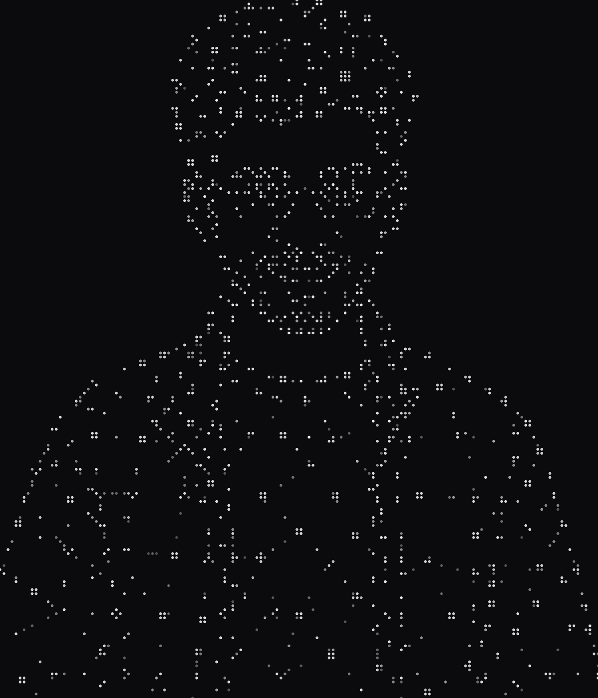

### Muhammad Umar Mirza

**Data Science & AI · Leiden University (LIACS)** · Honours Programme

Building intelligent AI systems — and the layer underneath them.

Most people learning AI stop at calling the API. I want the part below it: why a retrieval
pipeline returns the wrong chunk, why an agent loops, what the maths is actually doing.

Currently a Backend AI Engineering intern at **[flyrank.ai](https://flyrank.ai)** — RAG
architecture, vector databases, chunking strategies, retrieval pipelines.

[**umaarmirzaa.github.io**](https://umaarmirzaa.github.io) ·
[LinkedIn](https://linkedin.com/in/umaarmirzaa) ·
[umaarmirzaa@gmail.com](mailto:umaarmirzaa@gmail.com)

 

---

### Selected work

| Project | What it is | Stack |
|---|---|---|
| [**meme-mirror**](https://github.com/umaarmirzaa/meme-mirror) | Webcam reads hand gestures and facial expressions, pops the matching meme. Plain-geometry rules for poses the stock model misses, majority-vote smoothing against landmark jitter. No training. | MediaPipe · OpenCV · NumPy |
| [**tech-stack-recommender**](https://github.com/umaarmirzaa/tech-stack-recommender) | Content-based recommender mapping skills to ranked career paths. TF-IDF and cosine similarity written from scratch — no ML libraries — with cold-start handling. | Python, zero deps |
| [**supermarket-management-system**](https://github.com/umaarmirzaa/supermarket-management-system) | Relational schema with an IS-A staff hierarchy, weak entities, self-joins and M:N relations, plus sample data and queries. | SQL · ER modeling |
| [**python-fundamentals**](https://github.com/umaarmirzaa/python-fundamentals) | Eight self-contained projects: OOP class design, recursion, graph search, image processing. The fundamentals made load-bearing rather than decorative. | Python |
| [**iris-classification-ai**](https://github.com/umaarmirzaa/iris-classification-ai) | End-to-end scikit-learn classification pipeline. | scikit-learn |
| [**bytebot-chatbot**](https://github.com/umaarmirzaa/bytebot-chatbot) | Rule-based intent matching on an IPO model — O(1) dictionary lookup, sanitisation, fallback. Built at DecodeLabs. | Python |

---

### Stack

**Core** — Python · SQL · SQLite · Git
**AI / ML** — LLM applications · agentic systems · RAG · prompt engineering · NumPy · supervised & unsupervised learning · MediaPipe · OpenCV
**Foundations** — algorithms & data structures · OOP · relational databases · image processing · graph theory · calculus I–III · linear algebra

---

### Now

Retrieval pipelines at flyrank.ai. An hour a day on the AI-engineering track — currently
transformers from first principles. Retaking Algorithms & Data Structures and treating it
as a reason to learn the material properly rather than pass it.

Everything here is built rather than described. That's deliberate.
